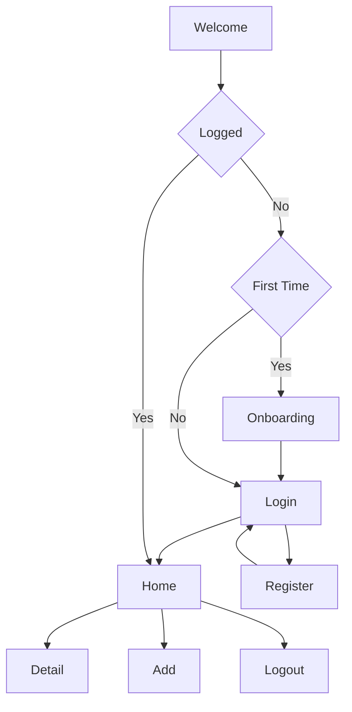

# **Snappy**


Snappy is an entertainment application that allows users to create stories, explore, and share their stories effortlessly. Share stories through photos and locations and tell them to everyone!

> **Project Type**: Course Assignment (Personal Project)  
>
> **Development Date**: January 2025  
> 
> **Role**: Mobile Developer (Multi Platform)

## Technologies Used


This application was developed using Git, GitHub, Android Studio, and Flutter as the primary framework.

## Challenges - Solutions - Impact

The development of this application faced several challenges, including managing state on each page, interacting with APIs, implementing clean architecture, integrating API data with Google Maps, implementing build variants, and localization.

### Challenges

- Interacting with APIs and displaying data from them.
- Uploading photos from the camera and gallery and performing image cropping.
- Creating build variants to introduce premium features.
- Integrating Google Maps into the application.
- Building scalable and maintainable code for future development.
- Implementing localization to support multiple languages.

### Solutions

- Using the `http` dependency for API interactions.
- Using the `bloc` dependency for state management to keep the UI consistent.
- Using the `intl` and `flutter_localizations` dependencies to support localization.
- Implementing build flavors to divide the app into two versions (free and premium).
- Using the `image_picker`, `hl_image_picker`, and `image` dependencies to support image capturing and cropping.
- Using the `go_router` dependency for routing and implementing dependency injection with `get_it`.
- Using the `google_maps_flutter` and `geocoding` dependencies to manipulate maps in the app.

### Impact

- The application requires an internet connection as data is not stored in a local database.
- The application presents stories effectively, and some stories can display their locations.
- Users can upload stories with location data if they are using the premium version.
- The application allows users to crop images before uploading them.
- The application's language can be changed, supporting four languages (Bahasa Indonesia, English, Korean, Chinese).

## Lesson Learned

From this project, I learned how to use Flutter as an application framework. This application taught me how to interact with APIs, use state management, implement routing and dependency injection, and create build variants.

- Improved my understanding of Flutter.
- Helped me understand API interactions.
- Helped me understand state management using `bloc`, routing with `go_router`, and dependency injection with `get_it`.
- Helped me understand build flavors and build variants in app development.
- Helped me understand multi-language localization.
- Helped me understand how to use Google Maps in Flutter.

# **Installation & Usage Guide**

Installing and using this application is simple and quick. Users can follow the steps below to get started.

## Installation

The installation process involves several basic steps to ensure the application runs smoothly on the user’s device.

To get started with Snappy, follow these steps:

1.  **Clone the repository**:
    
    ```sh
    git clone https://github.com/faradaii/snappy.git  
    ```
    
2.  **Navigate to the project directory**:
    
    ```sh
    cd snappy
    ```
    
3.  **Install dependencies**:  
    -   If using Android Studio or VS Code:
        Open **Terminal** and **Run** this command.
		  ```sh
		  flutter pub get
		  ```
        
    -   For other environments, please refer to the specific setup instructions.
        
4. **Run the application**:
    
    -   In Android Studio or VS Code:
        
        Select an emulator or physical device > click the **Run** button (or press Shift + F10).
        
    -   For other environments, follow the appropriate instructions.
        

## Usage

This application is easy to use. Users will be directed to the login screen if there is no active session on the device. The language can be changed by selecting the flag icon. Additionally, the "include location" feature is only available in the premium version.



----------
